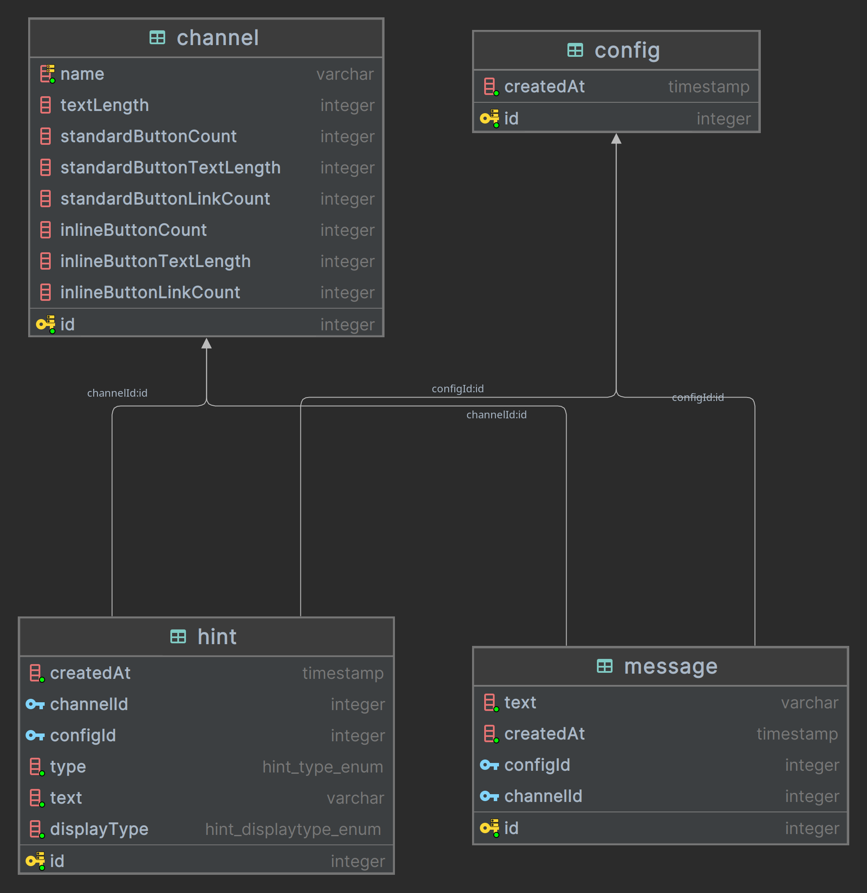

# Channels

## Словарь предметой области

Каналы - мессенджеры и прочие каналы связи 

Сообщение - текстовая информация, отправляющаяся на выбранный канал связи

Подсказка - компонент клиентской части, помогающий конечному пользователю придумать сообщение или перенаправляющий на другую страницу по определенной ссылке

## Функциональные требования

- Возможность просмотра всех каналов
- Настройка сообщений и кнопок-подсказок для каждого из каналов
- Высвечивание кнопок-подсказок для строки ввода сообщения, включая ‘кнопки с ссылками’ (Под полем ввода)
- Четкое разделение кнопок-подсказок на два вида - стандартного и inline типа
- Удаление последней созданной для канала подсказки
- Сохранение конфигурации каналов, учитывая значения сообщений и подсказок каждого из каналов, записываемая

## Нефункциоальные требования

1. Стек технологий:
    
    Серверная часть:
    
    - NestJS
    - TypeORM
    - PostgreSQL
    
    Клиентская часть:
    
    - ReactJS
    - Vite
    - Redux Toolkit
    - Bootstrap
2. Хранение конфигурации в пользовательской Базе Данных

# Схема базы данных


# Пример передачи объекта JSON для сохранения конфигурации
**POST** http://localhost:3000/config
```
{
    "messages" : [
       {
           "text" : "hello!",
           "channelId" : 1
       }
    ],
    "hints" : [
       {
           "text": "hello!",
           "type": 0,
           "channelId": 1,
           "displayType" : 1
       }
    ]
}
```